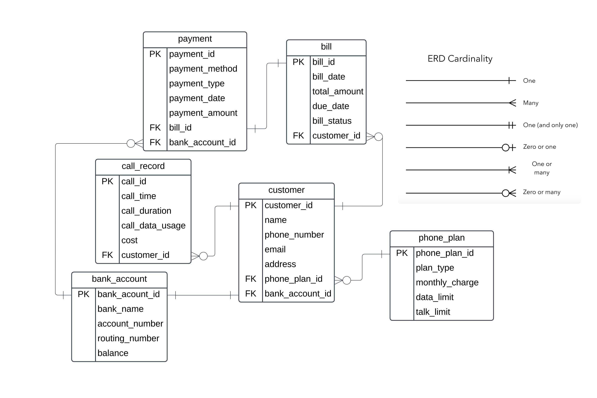

# Cell Company Web App

Our project is a web app for a database of a phone company that tracks the specifics of basic phone plans from the company's perspective. We are able to add a customer with an existing bank account into our database with a select phone plan that is offered. This data can also be deleted from our database. Payment history and bill summaries for customers can be found as well. Along with many other actions of a cell phone company system.

### ER Diagram

### Schema

~~~
-- Phone Plan Table
CREATE TABLE phone_plan (
    phone_plan_id INT PRIMARY KEY,
    plan_type VARCHAR(50) NOT NULL,
    monthly_charge DECIMAL(10, 2) NOT NULL,
    data_limit INT NOT NULL
);
~~~
This phone plan relation creates the table holding values for the customer's phone plan ID, the specific phone plan, their monthly charge, and their data limit.

~~~
--Bank Account Table
CREATE TABLE bank_account (
    bank_account_id INT PRIMARY KEY,
    bank_name VARCHAR(255) NOT NULL,
    account_number VARCHAR(50) NOT NULL,
    routing_number VARCHAR(50) NOT NULL,
    balance DECIMAL(10,2) NOT NULL
);
~~~
Bank account relation holds the specifics of the customer's account with their bank like the routing number and their balance.

~~~
-- Customer Table
CREATE TABLE customer (
    customer_id INT PRIMARY KEY,
    name VARCHAR(255) NOT NULL,
    phone_number VARCHAR(12) NOT NULL,
    email VARCHAR(255),
    address VARCHAR(255),
    phone_plan_id INT NOT NULL,
    bank_account_id INT NOT NULL,
    FOREIGN KEY (phone_plan_id) REFERENCES phone_plan(phone_plan_id),
    FOREIGN KEY (bank_account_id) REFERENCES bank_account(bank_account_id)
);
~~~
Customer holds the personal info of the customers with the company

~~~
--Call Record Table
CREATE TABLE call_record (
    call_id INT PRIMARY KEY,
    call_time DATETIME NOT NULL,
    call_duration INT NOT NULL,
    data_usage INT NOT NULL,
    cost DECIMAL(10, 2) NOT NULL,
    customer_id INT NOT NULL,
    FOREIGN KEY (customer_id) REFERENCES customer(customer_id)
);
~~~
Call Record tracks the details of the customer's phone calls along with the data usage and the cost of them.

~~~
--Phone Bill Table
CREATE TABLE bill (
    bill_id INT PRIMARY KEY,    
    bill_date DATE NOT NULL,
    total_amount DECIMAL(10,2) NOT NULL,
    due_date DATE NOT NULL,
    bill_status VARCHAR(20) NOT NULL,
    customer_id INT NOT NULL,
    FOREIGN KEY (customer_id) REFERENCES customer(customer_id)
);
~~~
Phone Bill holds values about the bill such as the assigned date and due date, the status (paid/unpaid), and the total amount.

~~~
--Payment Table
CREATE TABLE payment (
    payment_id INT PRIMARY KEY,
    payment_method VARCHAR(50) NOT NULL,
    payment_type VARCHAR(50) NOT NULL,
    payment_date DATE NOT NULL,
    payment_amount DECIMAL(10,2) NOT NULL,
    bill_id INT NOT NULL,
    bank_account_id INT NOT NULL,
    FOREIGN KEY (bill_id) REFERENCES bill(bill_id),
    FOREIGN KEY (bank_account_id) REFERENCES bank_account(bank_account_id)
);
~~~
Payment surrounds the payment of the bill considering the amount, the method of payment, and if it was pre/post-paid

Relationships:
~~~
-- Relationship from customer to phone plan: Many-to-One
-- Each customer can have only one phone plan, but multiple customers can have the same phone plan this is reinforced by the phone_plan_id foreign key in the customer table.

-- Relationship from customer to bank account: One-to-One
-- Each customer can have only one bank account, and each bank account belongs to one customer this is reinforced by the bank_account_id foreign key in the customer table.

-- Relationship from customer to call record: One-to-Many
-- Each customer can have multiple call records, but each call record belongs to one customer this is reinforced by the customer_id foreign key in the call_record table.

-- Relationship from customer to bill: One-to-Many
-- Each customer can have multiple bills, but each bill belongs to one customer this is reinforced by the customer_id foreign key in the bill table.

-- Relationship from payment to bill: One-to-One
-- Each payment is associated with one bill, and each bill is associated with one payment this is reinforced by the bill_id foreign key in the payment table.

-- Relationship from payment to bank account: Many-to-One
-- Each payment is made from one bank account, but multiple payments can be made from the same bank account this is reinforced by the bank_account_id foreign key in the payment table.
~~~

### Transaction

This transaction query handles the process of paying a customer's unpaid bill. Firstly by declaring an unpaid bill and locking its respective bank account for update. Then check the balance to see if the funds are sufficient enough to pay the bill. If yes, deduct the funds from the account 

